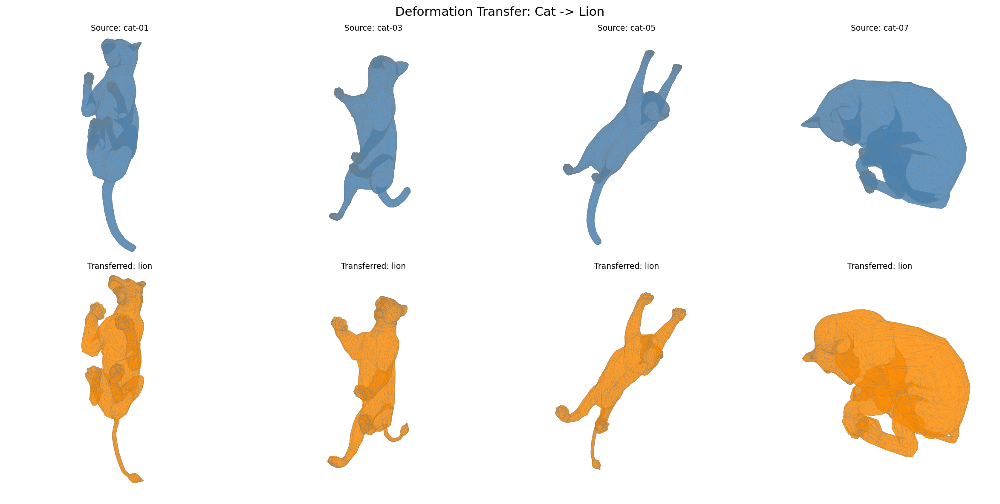

# Deformation Transfer for Triangle Meshes

Python implementation of [Sumner & Popovic, SIGGRAPH 2004](https://people.csail.mit.edu/sumner/research/deftransfer/Sumner2004DTF.pdf).

Transfers deformations from a source mesh onto a different target mesh. The source and target do not need to share the same topology.



## Requirements

```
numpy
scipy
pyyaml
pyvista   # for interactive 3D visualization
```

```bash
pip install numpy scipy pyyaml pyvista
```

## Usage

### Run Deformation Transfer

```bash
# Cat -> Lion
python main.py --config source_obj/markers-cat-lion.yml

# Horse -> Camel
python main.py --config source_obj/markers-horse-camel.yml
```

The first run computes correspondence and saves it to `output/correspondence.npy`. Subsequent runs can skip this step:

```bash
python main.py --config source_obj/markers-cat-lion.yml --correspondence output/correspondence.npy
```

### Visualize Results

```bash
# Interactive 3D: all poses side by side
python visualize.py --config source_obj/markers-cat-lion.yml --all

# Single pose comparison (2x2 grid)
python visualize.py --config source_obj/markers-cat-lion.yml --pose 3
```

## Pipeline

| Phase | File | Description |
|-------|------|-------------|
| 1 | `phase1.py` | Mesh I/O, adjacency, utilities |
| 2 | `phase2.py` | Per-triangle affine transformations (Eq. 1-4) |
| 3 | `phase3.py` | Correspondence via marker-guided ICP (Section 5) |
| 4 | `phase4.py` | Deformation transfer: sparse least-squares solve (Section 4) |

## Config Format

YAML files in `source_obj/` define source/target meshes and marker pairs:

```yaml
source:
  reference: cat-poses/cat-reference.obj
  poses:
    - cat-poses/cat-01.obj
    - cat-poses/cat-02.obj
target:
  reference: lion-poses/lion-reference.obj
markers:
  - "2653:1316"  # source_vertex:target_vertex
  - "2620:1412"
```
